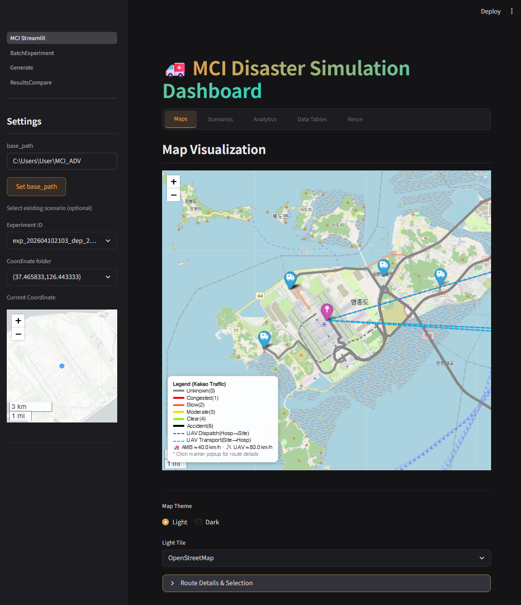

# ADReSS: Automated Disaster Response Scenario Generation and Simulation for Evaluating Emergency Medical Services System


[](https://www.sciencedirect.com/journal/simulation-modelling-practice-and-theory)

> **Paper Status:** Submitted to *Simulation Modelling Practice and Theory* (April 14, 2026). Currently under review.



## Project Overview

A simulation and analysis platform for **optimizing patient transport** during Mass Casualty Incidents (MCI).

### Key Features
- **Scenario Generation**: Real-time/future traffic data via Kakao Mobility API or OSRM
- **Simulation Engine**: Evaluates 64 policy combinations using ambulances (AMB) and drones (UAV)
- **Statistical Analysis**: Full Factorial ANOVA with post-hoc tests
- **Visualization Dashboard**: Streamlit-based web interface

---

## Table of Contents

1. [Directory Structure](#directory-structure)
2. [Pipeline Overview](#pipeline-overview)
3. [Module Import Relations](#module-import-relations)
4. [Simulation Engine Architecture](#simulation-engine-architecture)
5. [Input File Structure](#input-file-structure)
6. [API Usage](#api-usage)
7. [Policy Combinations (64 Scenarios)](#policy-combinations-64-scenarios)
8. [Dashboard Usage](#dashboard-usage)
9. [Evaluation Metrics](#evaluation-metrics)
10. [Batch Experiment Pipeline (experiment_1)](#batch-experiment-pipeline-experiment_1)
11. [Installation and Execution](#installation-and-execution)

---

## Directory Structure

```
ADReSS/
├── src/                                    # Source code
│   ├── sce_src/                           # Scenario generation module
│   │   ├── orchestrator.py               # Master orchestrator
│   │   ├── make_csv_yaml_dynamic.py      # Dynamic scenario generator
│   │   └── BatchLab.py                   # Batch processing dashboard
│   │
│   ├── sim_src/                          # Simulation engine
│   │   ├── main.py                       # Simulation entry point (RunManager)
│   │   ├── ScenarioManager.py            # Scenario setup and entity initialization
│   │   ├── EntityManager.py              # Entity state management
│   │   ├── EventManager.py               # Event queue and simulation loop
│   │   ├── RuleManager.py                # Policy rule management (64 combinations)
│   │   ├── MCIEnvironment_gymnasium.py   # Gymnasium environment wrapper
│   │   ├── config.yaml                   # Simulation configuration template
│   │   └── event_info.json               # Event definitions (8 events)
│   │
│   └── vis_src/                          # Visualization / Dashboard
│       ├── MCI_Streamlit.py              # Main dashboard
│       └── pages/
│           ├── Generate.py               # Scenario generation UI
│           ├── ResultsCompare.py         # Results comparison page
│           └── BatchExperiment.py        # Batch experiment dashboard (5-step workflow)
│
├── scenarios/                             # Scenario data
│   ├── fire_stations.csv                  # Fire station / 119 safety center master (required)
│   ├── hospital_master_data.xlsx          # Hospital master data (required)
│   ├── DISTANCE_MATRIX_FINAL.xlsx         # Pre-computed distance matrix
│   ├── label_map.csv                      # Experiment coordinate labels
│   └── exp_{base}_dep_{HHMM}/ or exp_{base}_osrm/   # Generated scenarios (Kakao=_dep_, OSRM=_osrm)
│       └── (lat,lon)/                     # Per-coordinate folder
│           ├── config_(lat,lon).yaml      # Simulation configuration
│           ├── patient_info.csv           # Patient severity distribution
│           ├── hospital_info_road.csv     # Hospital info (road distance)
│           ├── hospital_info_euc.csv      # Hospital info (Euclidean distance)
│           ├── amb_info_road.csv          # Ambulance dispatch info (road)
│           ├── amb_info_euc.csv           # Ambulance dispatch info (Euclidean)
│           ├── uav_info.csv               # UAV dispatch info
│           ├── distance_Hos2Hos_*.csv     # Hospital-to-hospital distance matrix
│           ├── distance_Hos2Site_*.csv    # Hospital-to-site distance matrix
│           └── routes/                    # Route JSON files
│               ├── center2site/           # Fire station → Incident site
│               └── hos2site/              # Incident site → Hospital
│
├── results/                               # Simulation results
│   └── exp_{base}_dep_{HHMM}/ or exp_{base}_osrm/
│       └── (lat,lon)/
│           ├── results_(lat,lon).txt      # RAW results (full data)
│           └── results_(lat,lon)_stat.txt # Statistical summary
│
├── experiment_logs/                       # Execution logs
│   └── (lat,lon)_YYYYMMDD_HHMMSS.txt
│
├── experiment_1/                          # Paper batch experiment pipeline
│   ├── generate_coords.py                # Generate 1000 random land coordinates in South Korea
│   ├── batch_runner.py                   # Scenario generation + simulation batch processing
│   ├── visualize_coords.py               # Batch result map/histogram/rule analysis visualization
│   └── ctprvn.shp / .shx / .dbf         # South Korea administrative boundary shapefile
│
├── requirements.txt                       # Python package dependencies
└── README.md                              # This document
```

---

## Pipeline Overview

The overall system consists of a 3-stage pipeline:

```
┌──────────────────────────────────────────────────────────────────────────────┐
│                         1. Scenario Generation Pipeline                      │
├──────────────────────────────────────────────────────────────────────────────┤
│                                                                              │
│  User Input (Generate.py)                                                    │
│    ├─ Coordinates (latitude, longitude)                                      │
│    ├─ Number of patients, ambulances, UAVs                                   │
│    ├─ Travel speed (AMB: 40km/h, UAV: 80km/h)                               │
│    └─ Kakao API key + departure time                                         │
│                     ↓                                                        │
│  Orchestrator.generate_scenario()                                            │
│                     ↓                                                        │
│  ScenarioGenerator (make_csv_yaml_dynamic.py)                                │
│    ├─ Load hospital master data (hospital_master_data.xlsx)                   │
│    ├─ Load fire station data (fire_stations.csv)                             │
│    ├─ Call Kakao Mobility API (road distance + travel time)                   │
│    ├─ Generate patient_info.csv (severity distribution)                       │
│    ├─ Generate hospital/ambulance/uav CSVs                                   │
│    ├─ Generate distance matrices (Hos2Hos, Hos2Site)                         │
│    ├─ Generate routes/*.json (API response storage)                          │
│    └─ Generate config_{coord}.yaml                                           │
│                     ↓                                                        │
│  scenarios/exp_{base}_dep_{HHMM}/(lat,lon)/  or  exp_{base}_osrm/...        │
│                                                                              │
└──────────────────────────────────────────────────────────────────────────────┘

┌──────────────────────────────────────────────────────────────────────────────┐
│                         2. Simulation Execution Pipeline                     │
├──────────────────────────────────────────────────────────────────────────────┤
│                                                                              │
│  Orchestrator.run_simulation(config_path)                                    │
│                     ↓                                                        │
│  main.py --config_path config.yaml                                           │
│                     ↓                                                        │
│  RunManager initialization                                                   │
│    ├─ ScenarioManager: Load entity configs (patients, hospitals, AMBs, UAVs) │
│    │     ├─ EntityManager: Entity state management                           │
│    │     └─ EventManager: Event queue management                             │
│    ├─ RuleManager: Generate 64 policy rules (Full Factorial)                 │
│    └─ MCIEnvironment_gymnasium: Create simulation environment                │
│                     ↓                                                        │
│  Simulation loop (totalSamples × 64 rules)                                   │
│    ├─ env.reset() → initial observation                                      │
│    ├─ While not done:                                                        │
│    │     ├─ EventManager.run_next() → process event                          │
│    │     ├─ rule.select(observation) → action selection                       │
│    │     └─ env.step(action) → observation, reward, done                     │
│    └─ Record results: [Reward, Time, PDR, Reward_woG, PDR_woG]              │
│                     ↓                                                        │
│  results/exp_{...}/(lat,lon)/                                                │
│    ├─ results_(lat,lon).txt       (RAW data)                                 │
│    └─ results_(lat,lon)_stat.txt  (Stats: mean, std, 95% CI)                │
│                                                                              │
└──────────────────────────────────────────────────────────────────────────────┘

┌──────────────────────────────────────────────────────────────────────────────┐
│                         3. Visualization & Analysis Pipeline                 │
├──────────────────────────────────────────────────────────────────────────────┤
│                                                                              │
│  MCI_Streamlit.py Dashboard                                                  │
│    │                                                                         │
│    ├─ Settings (sidebar)                                                     │
│    │     ├─ Project path selection                                           │
│    │     ├─ Experiment ID selection                                          │
│    │     ├─ Coordinate selection                                             │
│    │     └─ Mini-map display                                                 │
│    │                                                                         │
│    ├─ Scenarios tab                                                          │
│    │     ├─ experiment_logs log viewer                                        │
│    │     ├─ Per-patient rescue → transport → treatment timeline              │
│    │     ├─ Event table                                                      │
│    │     └─ Rule / Iteration filter                                          │
│    │                                                                         │
│    ├─ Maps tab                                                               │
│    │     ├─ Folium map rendering                                             │
│    │     ├─ C→S route (fire station → incident site): purple dashed          │
│    │     ├─ S→H route (incident site → hospital): teal dashed               │
│    │     ├─ Congestion color coding                                          │
│    │     └─ Route info popup (distance km, time min)                         │
│    │                                                                         │
│    ├─ Analytics tab                                                          │
│    │     ├─ results_.txt parsing                                             │
│    │     ├─ ANOVA analysis (Full Factorial, One-way, RCBD)                   │
│    │     ├─ Post-hoc tests (Tukey HSD, Games-Howell)                         │
│    │     ├─ Residual diagnostics (Shapiro-Wilk, QQ plot)                     │
│    │     └─ Group-A intersection recommendation                              │
│    │                                                                         │
│    ├─ Data Tables tab                                                        │
│    │     ├─ Real-time CSV editing                                            │
│    │     ├─ Auto backup                                                      │
│    │     └─ Re-run with modified values                                      │
│    │                                                                         │
│    ├─ Rerun tab                                                              │
│    │     └─ Re-run simulation from existing YAML                             │
│    │                                                                         │
│    └─ Generate page (pages/Generate.py)                                      │
│          ├─ Kakao API key input                                              │
│          ├─ Departure time mode (real-time / future)                         │
│          ├─ Parameter configuration                                          │
│          └─ Scenario generation + immediate execution                        │
│                                                                              │
└──────────────────────────────────────────────────────────────────────────────┘
```

---

## Module Import Relations

### 1. MCI_Streamlit.py (Main Dashboard)
```
MCI_Streamlit.py
    ↓ imports
    ├── orchestrator (src/sce_src)  ──→ Orchestrator class
    ├── pandas, numpy, yaml         ──→ Data I/O
    ├── streamlit, folium, altair   ──→ UI rendering
    ├── scipy, statsmodels          ──→ Statistical analysis
    └── openpyxl                    ──→ Excel file processing
```

### 2. main.py (Simulation Entry Point)
```
main.py
    ↓ imports
    ├── ScenarioManager.py
    │     ├── EntityManager.py
    │     └── EventManager.py
    ├── RuleManager.py              ──→ Universal_Rule class (64 rules)
    ├── MCIEnvironment_gymnasium.py ──→ gymnasium.Env
    ├── yaml, argparse              ──→ Config parsing
    └── numpy, scipy                ──→ Numerical computation
```

### 3. orchestrator.py (Orchestrator)
```
orchestrator.py
    ↓ imports
    ├── make_csv_yaml_dynamic.py    ──→ ScenarioGenerator class
    ├── subprocess                  ──→ main.py execution
    ├── requests                    ──→ Kakao API calls
    ├── pandas, yaml                ──→ Data processing
    └── time, datetime              ──→ Logging
```

### 4. make_csv_yaml_dynamic.py (Scenario Generator)
```
make_csv_yaml_dynamic.py
    ↓ imports
    ├── requests                    ──→ Kakao Mobility API
    ├── haversine                   ──→ Euclidean distance calculation (fallback)
    ├── pandas                      ──→ Excel/CSV I/O
    └── yaml, json                  ──→ Config file generation
```

---

## Simulation Engine Architecture

### Class Hierarchy

```
RunManager (main.py)
│
├── config ← YAML configuration parsing
│
├── ScenarioManager
│   │
│   ├── EntityManager
│   │   └── en_status: dict  ← Entity states
│   │       ├── patient: p_states, p_wait, p_sent
│   │       ├── hospital: h_states (idle, queue, occupied)
│   │       ├── ambulance: amb_states, amb_wait
│   │       └── uav: uav_states, uav_wait
│   │
│   └── EventManager
│       ├── event_queue: heapq  ← Priority queue (time-ordered)
│       ├── events: onset, p_rescue, amb_arrival_site, ...
│       └── time: simulation clock
│
├── RuleManager
│   └── rules: List[Universal_Rule]  ← 64 policy combinations
│       └── Decision factors:
│           ├── Priority: START vs ReSTART
│           ├── Hospital Selection: RedOnly vs YellowNearest
│           ├── Red Action: OnlyUAV, Both_UAVFirst, Both_AMBFirst, OnlyAMB
│           └── Yellow Action: OnlyUAV, Both_UAVFirst, Both_AMBFirst, OnlyAMB
│
└── MCIEnvironment_gymnasium (gym.Env)
    ├── action_space: (patient_severity, hospital_idx, transport_mode)
    ├── observation_space: entity states
    ├── step(): execute action → (obs, reward, done, truncated, info)
    ├── reset(): initialize scenario
    └── Reward = Σ[Patient_i: SurvivalProb(rescue_time, severity)]
```

### Event Flow (event_info.json)

| Event | Participating Entities | Decision Epoch | Description |
|-------|----------------------|----------------|-------------|
| `onset` | patient | No | Incident occurs, patient rescue event generated |
| `p_rescue` | patient | **Yes** | Patient rescue complete, transport wait begins |
| `amb_arrival_site` | ambulance | **Yes** | Ambulance arrives at scene |
| `uav_arrival_site` | uav | **Yes** | UAV arrives at scene |
| `amb_arrival_hospital` | patient, ambulance, hospital | No | Ambulance arrives at hospital, patient handover |
| `uav_arrival_hospital` | patient, uav, hospital | No | UAV arrives at hospital, patient handover |
| `p_care_ready` | patient, hospital | No | Patient ready for treatment |
| `p_def_care` | patient, hospital | No | Patient treatment complete |

### Simulation Loop (EventManager.run_next)

```python
While True:
    1. Pop earliest event from event_queue
    2. Advance simulation clock
    3. Update resource states (ambulance/UAV travel times)
    4. Execute event handler (ev_onset, ev_p_rescue, ...)
    5. If decision_epoch=True: request action from policy
    6. Check termination condition (all patients treated)
    7. Continue
```

### Entity State Structure

**Patient state**: `p_states[patient_id] = [severity_class, rescued, moving, moved, cared]`
- severity_class: 0=Red, 1=Yellow, 2=Green, 3=Black
- rescued: 0=not rescued, 1=rescued
- moving: 0=waiting, 1=in transit
- moved: 0=at scene, 1=arrived at hospital
- cared: 0=untreated, 1=treatment started, 2=treatment complete

**Hospital state**: `h_states[hospital_id] = [n_idle, n_queue, n_occupied]`
- n_idle: available beds
- n_queue: waiting patients
- n_occupied: occupied beds

**Ambulance state**: `amb_states[amb_id] = [destination_hospital_id, severity_carrying, time_to_arrival]`

**UAV state**: `uav_states[uav_id] = [destination_hospital_id, severity_carrying, time_to_arrival]`

---

## Input File Structure

### 1. Master Data

#### fire_stations.csv (Required)
```
Path: scenarios/fire_stations.csv
Encoding: UTF-8-sig

Columns:
- parent_hq: Regional headquarters name
- station_name: Fire station / 119 safety center name
- address: Full address
- y_coord: Latitude
- x_coord: Longitude
- phone: Contact number
- type: Fire station / 119 safety center
- reg_date: Data reference date
- num_vehicles: Number of ambulances (used for replication)
```

#### hospital_master_data.xlsx (Required)
```
Path: scenarios/hospital_master_data.xlsx
Encoding: UTF-8 (openpyxl)

Columns:
- institution_name: Hospital name
- type_code: 1=Tertiary general, 11=General, 21=Hospital, ...
- num_er_beds: Number of emergency room beds
- x_coord: Longitude
- y_coord: Latitude
- helipad: 1=Yes, 0=No (UAV landing capability)
```

### 2. Generated Scenario Files

#### config_(lat,lon).yaml
```yaml
entity_info:
  patient:
    incident_size: 30              # Total number of patients
    latitude: 37.465833            # Incident site latitude
    longitude: 126.443333          # Incident site longitude
    incident_type: null            # Incident type (for extension)
    info_path: "./patient_info.csv"

  hospital:
    load_data: True
    info_path: "./hospital_info_road.csv"
    dist_Hos2Hos_euc_info: "./distance_Hos2Hos_euc.csv"
    dist_Hos2Hos_road_info: "./distance_Hos2Hos_road.csv"
    dist_Hos2Site_euc_info: "./distance_Hos2Site_euc.csv"
    dist_Hos2Site_road_info: "./distance_Hos2Site_road.csv"
    max_send_coeff: [1, 1]         # max_send = a*capa + b*queue

  ambulance:
    load_data: True
    dispatch_distance_info: "./amb_info_road.csv"
    velocity: 40                   # km/h
    handover_time: 0               # Patient handover time (min)
    is_use_time: True              # True: Kakao API duration / False: OSRM static (distance/velocity)
    duration_coeff: 1.0            # Duration weight
    road_provider: kakao           # Road data provider used during scenario generation (kakao | osrm)

  uav:
    load_data: True
    dispatch_distance_info: "./uav_info.csv"
    velocity: 80                   # km/h
    handover_time: 0               # Patient handover time (min)

event_info_path: "event_info.json"

rule_info:
  isFullFactorial: True            # All 64 combinations
  priority_rule: ["START", "ReSTART"]
  hos_select_rule: ["RedOnly", "YellowNearest"]
  red_mode_rule: ["OnlyUAV", "Both_UAVFirst", "Both_AMBFirst", "OnlyAMB"]
  yellow_mode_rule: ["OnlyUAV", "Both_UAVFirst", "Both_AMBFirst", "OnlyAMB"]

run_setting:
  totalSamples: 30                 # Number of iterations
  random_seed: 0                   # Random seed (null = unfixed)
  rule_test: True
  eval_mode: True
  output_path: "./results"
  exp_indicator: "(lat,lon)"       # Result file suffix
  save_info: True
```

#### patient_info.csv
```csv
type,ratio,rescue_param_alpha,rescue_param_beta,treat_tier3,treat_tier2,treat_tier3_mean,treat_tier2_mean
Red,0.1,6,5,True,False,40,INF
Yellow,0.3,2,13,True,True,20,30
Green,0.5,1,22,True,True,10,15
Black,0.1,0,0,True,True,0,0
```
- ratio: Patient proportion (sum = 1.0)
- rescue_param_alpha/beta: Rescue time beta distribution parameters
- treat_tier3: Treatable at tertiary general hospital (Tier3)
- treat_tier2: Treatable at general hospital
- treat_tier3/2_mean: Treatment time exponential distribution mean (min)

#### hospital_info_road.csv
```csv
Index,institution_name,type_code,num_er_beds,num_or,num_beds,helipad,x_coord,y_coord,distance,duration
0,Seoul National University Hospital,1,50,3,47,1,126.9997,37.5795,15.3,28.5
1,Yonsei University College of Medicine,1,45,3,42,1,126.9406,37.5622,12.1,22.3
...
```

#### amb_info_road.csv
```csv
Index,init_distance,duration,fire_station_name,num_vehicles
0,5.2,8.5,Yeongdeungpo Fire Station,3
1,6.8,11.2,Guro 119 Safety Center,2
...
```

#### uav_info.csv
```csv
Index,init_distance,hospital_name
0,15.3,Seoul National University Hospital
1,12.1,Yonsei University College of Medicine
...
```

#### routes/*.json (Kakao API Response)
```json
{
  "meta": {
    "api_provider": "kakao",
    "route_type": "center2site",
    "source_index": 0,
    "name": "Yeongdeungpo Fire Station",
    "center": [126.9123, 37.5234],
    "site": [126.9456, 37.5567],
    "departure_time": "202502091030",
    "distance_km": 5.2,
    "duration_min": 8.5,
    "duration_sec": 510
  },
  "payload": {
    "kakao_response": { ... }
  }
}
```

---

## API Usage

### Kakao Mobility API

#### Reverse Geocoding (Coordinates → Address)
```python
# orchestrator.py: reverse_geocode_kakao()
URL: https://dapi.kakao.com/v2/local/geo/coord2address.json
Headers: {"Authorization": "KakaoAK {API_KEY}"}
Params: {"x": lon, "y": lat, "input_coord": "WGS84"}

Response:
{
  "full_address": "Seoul Yeongdeungpo-gu Yeouido-dong",
  "road_address": "Seoul Yeongdeungpo-gu Yeoui-naru-ro 76",
  "area1": "Seoul",
  "area2": "Yeongdeungpo-gu",
  "area3": "Yeouido-dong",
  "area4": ""
}
```

#### Road Distance and Travel Time
```python
# make_csv_yaml_dynamic.py: get_road_distance_kakao()
URL: https://apis-navi.kakaomobility.com/v1/future/directions
Headers: {"Authorization": "KakaoAK {API_KEY}"}
Params: {
  "origin": "lon,lat",
  "destination": "lon,lat",
  "priority": "TIME",
  "departure_time": "YYYYMMDDHHMM"  # Future time (optional)
}

Response:
{
  "routes": [{
    "summary": {
      "distance": 5200,      # meters
      "duration": 510,       # seconds
      "fare": {"toll": 0, "taxi": 3500}
    }
  }]
}
```

#### API Key Configuration
```python
# 1. Streamlit Cloud (secrets.toml)
[kakao]
rest_api_key = "your_api_key"

# 2. Environment variable
export KAKAO_REST_API_KEY="your_api_key"

# 3. Direct input via Generate.py UI
```

### OSRM Backend (Open-source, No Kakao Key Required)

The Kakao Mobility API is a paid service limited to South Korea, making it difficult for external users or code reviewers to run the same pipeline. When generating scenarios with `is_use_time=False`, the system uses the [OSRM](https://project-osrm.org/docs/v5.24.0/api/#) HTTP API instead of Kakao to obtain road distance/time, saving in the **same JSON/CSV/YAML schema** as Kakao. Therefore, all downstream components (simulator, visualization) work identically.

```bash
# Use OSRM demo server without Kakao key (small-scale testing only)
python src/sce_src/make_csv_yaml_dynamic.py \
  --base_path . --latitude 37.5665 --longitude 126.9780 \
  --incident_size 30 --amb_count 30 --uav_count 3 \
  --is_use_time false --experiment_id osrm_demo
```

For production use, self-hosting is recommended (the demo server has a fair-use policy):

```bash
# Download South Korea OSM extract and pre-process once
wget https://download.geofabrik.de/asia/south-korea-latest.osm.pbf
docker run -t -v "$(pwd):/data" osrm/osrm-backend osrm-extract -p /opt/car.lua /data/south-korea-latest.osm.pbf
docker run -t -v "$(pwd):/data" osrm/osrm-backend osrm-partition  /data/south-korea-latest.osrm
docker run -t -v "$(pwd):/data" osrm/osrm-backend osrm-customize  /data/south-korea-latest.osrm
# Start routing server
docker run -t -i -p 5000:5000 -v "$(pwd):/data" osrm/osrm-backend \
  osrm-routed --algorithm mld /data/south-korea-latest.osrm

# Specify self-hosted OSRM instance during scenario generation
export MCI_OSRM_URL=http://localhost:5000   # or --osrm_url argument
python src/sce_src/make_csv_yaml_dynamic.py ... --is_use_time false --osrm_url http://localhost:5000
```

In `is_use_time=False` mode, the OSRM duration is also stored in the CSV `duration` column. Thus, **re-running the simulation on the same scenario folder with YAML `is_use_time` set to True** enables OSRM-duration-based simulation (branch logic: `src/sim_src/ScenarioManager.py:191-212`). The first simulation operates via the `distance/velocity` branch.

#### OSRM Response Mapping
```
GET {osrm_url}/route/v1/driving/{lon1},{lat1};{lon2},{lat2}
    ?overview=full&geometries=geojson&steps=false&annotations=false

routes[0].distance (m)         → distance_km = / 1000
routes[0].duration (s)         → duration_min = / 60
routes[0].geometry.coordinates → polyline for map visualization
```

The stored JSON follows the same `{meta, payload}` structure as Kakao, with `meta.api_provider == "osrm"` and the full response in `payload.osrm_response`. The dashboard map (`MCI_Streamlit.draw_route_from_json`) selects Kakao/OSRM rendering based on `api_provider` (OSRM uses a single-color polyline since congestion data is unavailable).

#### Error Handling
- **401 (Auth failure)**: API key verification required → abort
- **429 (Rate limit)**: Retry after 2-second wait (max 3 retries)
- **Timeout**: 15 seconds → fallback to Euclidean distance (Haversine)

---

## Policy Combinations (64 Scenarios)

```
2 (Priority) × 2 (Hospital Selection) × 4 (Red Action) × 4 (Yellow Action) = 64
```

### Priority (Patient Prioritization)
| Value | Description |
|-------|-------------|
| START | Establish full patient assignment plan at the beginning |
| ReSTART | Reassign remaining patients upon each hospital arrival (τ calculation) |

ReSTART τ calculation:
```
τ = 71 - (0.5 × num_D × (θ_amb/K_amb + θ_uav/K_uav))
- num_D: Number of remaining Yellow patients
- θ: Average round-trip time
- K: Number of transport vehicles
```

### Hospital Selection
| Value | Description |
|-------|-------------|
| RedOnly | Red patients: tertiary general hospitals only; Yellow: general hospitals only |
| YellowNearest | Red: tertiary general; Yellow: nearest by distance (regardless of tier) |

### Red/Yellow Action (Transport Mode Selection)
| Value | Description |
|-------|-------------|
| OnlyUAV | Use UAV only (wait if unavailable) |
| OnlyAMB | Use ambulance only (wait if unavailable) |
| Both_UAVFirst | UAV preferred, ambulance if unavailable |
| Both_AMBFirst | Ambulance preferred, UAV if unavailable |

### Scenario Naming Convention
```
{Priority}, {HosSelect}, Red {RedAction}, Yellow {YellowAction}

Examples:
- START, RedOnly, Red OnlyUAV, Yellow OnlyAMB
- ReSTART, YellowNearest, Red Both_AMBFirst, Yellow Both_UAVFirst
```

---

## Dashboard Usage

### How to Run
```bash
# Main dashboard
cd src/vis_src
streamlit run MCI_Streamlit.py

# Scenario generation page (standalone)
streamlit run pages/Generate.py
```

### Tab Functions

#### 1. Settings (Sidebar)
- **Project path**: Enter the project root directory path
- **Experiment ID**: Select from `exp_<base>_dep_<HHMM>` (Kakao mode) or `exp_<base>_osrm` (OSRM mode) dropdown
- **Coordinate selection**: `(lat,lon)` dropdown
- **Mini-map**: Displays the selected coordinate location

#### 2. Scenarios Tab
- Log file selection (experiment_logs/)
- **Rule selection**: Choose from 64 policies
- **Iteration selection**: Choose from iteration count
- **Patient summary table**: Rescue time → Transport mode → Hospital → Arrival time → Treatment complete
- **Event table**: Full simulation event timeline

#### 3. Maps Tab
- **Theme**: Light / Dark
- **Route display**:
  - AMB C→S (fire station → incident site): solid line, congestion-colored
  - AMB S→H (incident site → hospital): solid line
  - UAV dispatch: dashed line (tertiary hospital → incident site)
  - UAV transport: dashed line (incident site → hospital)
- **Legend**: Congestion colors + AMB/UAV speed display
- **Popup**: Click to show distance (km), time (min)

#### 4. Analytics Tab
- **Metric selection**: Reward, Time, PDR, Reward w.o.G, PDR w.o.G
- **Sort criteria**: Reward↓, PDR↑, Time↑
- **ANOVA design**:
  - Full Factorial: Phase × RedPolicy × RedAction × YellowAction
  - One-way: Single factor
  - RCBD: Randomized Complete Block Design
- **Significance level**: α = 0.001 ~ 0.1
- **Post-hoc tests**: Tukey HSD (equal variance), Games-Howell (unequal variance)
- **Residual diagnostics**: Shapiro-Wilk test, QQ plot, histogram
- **Group-A intersection**: Recommend scenarios in the top group across all metrics

#### 5. Data Tables Tab
- CSV file selection (filename only, path hidden)
- Real-time editing enabled (except `fire_stations.csv`)
- Auto backup on save: `*_backup_{timestamp}.csv`
- "Re-run with modified values" button

#### 6. Rerun Tab
- Select existing YAML configuration file
- Re-run simulation

#### 7. Generate Page (pages/Generate.py)
1. **Kakao API key input**
2. **Departure time mode selection**:
   - Real-time: Reflects current traffic conditions
   - Future time: Enter in YYYYMMDDHHMM format
3. **Parameter configuration**:
   - Latitude / Longitude
   - Number of patients (default: 30)
   - Number of ambulances (default: 30)
   - Number of UAVs (default: 3)
   - Ambulance speed (default: 40 km/h)
   - UAV speed (default: 80 km/h)
   - Simulation iterations (default: 10)
   - Random seed (default: 0)
4. **Generate and run**: Automatically runs simulation after scenario generation

---

## Evaluation Metrics

| Metric | Calculation | Interpretation |
|--------|------------|----------------|
| **Reward** | Σ SurvivalProb(rescue_time, severity) | Sum of survival probabilities (↑ better) |
| **Time** | Last patient treatment completion time | Total elapsed time (↓ better) |
| **PDR** | 1 - Reward / Preventable | Preventable Death Rate (↓ better) |
| **Reward w.o.G** | Reward - Green patient contribution | Reward excluding Green (↑ better) |
| **PDR w.o.G** | 1 - (Reward - Green) / (Preventable - Green) | PDR excluding Green (↓ better) |

### Survival Probability Calculation
```
SurvivalProb = f(rescue_time, severity_class)
- Red: Highly time-sensitive (rapid transport critical)
- Yellow: Moderate time sensitivity
- Green: Low time impact
- Black: Deceased (contribution = 0)
```

---

## Batch Experiment Pipeline (experiment_1)

An automated batch workflow for paper experiments. Processes 1000 random coordinates within South Korea's land boundaries through scenario generation → simulation → result visualization. See [`experiment_1/README.md`](experiment_1/README.md) for detailed usage.

### Overall Flow

```
Step 1. Generate coordinates
  python experiment_1/generate_coords.py --n 1000 --seed 0
  → experiment_1/coords_korea.csv (1000 land coordinates in South Korea)

Step 2. Batch experiment (run the same command daily; auto-resumes from progress.json)
  python experiment_1/batch_runner.py --kakao-api-key YOUR_KEY --experiment-id exp_korea_random_1000

Step 3. Visualize results
  python experiment_1/visualize_coords.py
  → Visualization files generated in scenarios/{experiment_id}/
```

> Visualization outputs (coords_map.html, histograms, rule heatmaps, main effects plots) are saved in the `scenarios/{experiment_id}/` folder and can also be viewed on the dashboard's BatchExperiment page.

### visualize_coords.py Features

- **Result map (single HTML)**: Switch between Reward / Time / PDR metrics via JavaScript buttons
- **Map tile switching**: OpenStreetMap / CartoDB tile selection
- **Colormap**: RdYlGn (red↔green), P5~P95 percentile clipping for relative comparison
- **Outlier highlighting**: Top/bottom N coordinates displayed in distinct colors (blue/purple)
- **Outlier list**: Collapsible `<details>` panel showing coordinates and indices
- **Histogram**: Freedman-Diaconis bin width (min 60, max 120 bins), outlier bins in distinct color, rug plot
- **Rule heatmap**: 64-rule × 3-metric × 4-panel (Priority×HosSelect) matrix, each panel 4×4 (Red Mode × Yellow Mode)
- **Main effects plot**: Marginal mean bar chart for 4 factors, best level with red border + ★ marker, effect size box

```bash
python experiment_1/visualize_coords.py [options]
  --clip-pct FLOAT   Colormap clipping percentile (default: 5.0 → 5th~95th)
  --outlier-n INT    Number of outliers per side (default: 3)
  --out PATH         Output HTML path (default: experiment_1/coords_map.html)
  --hist-format FMT  Histogram format pdf|png (default: pdf)
```

### stat.txt Structure

Simulation results `results_*_stat.txt` consist of 320 rows:
```
64 rules × 5 blocks = 320 rows
Block order: Reward → Time → PDR → RewardWOG → PDRWOG
Each row: rule_name  mean  std  95%CI_half
Visualization value = average of 64 means per block (mean of means)
```

---

## Installation and Execution

### Environment Requirements
- Python 3.12 or higher
- Windows / Linux / macOS

### Installation
```bash
# 1. Create Conda environment (recommended)
conda create -n MCI python=3.12
conda activate MCI

# 2. Install packages
pip install -r requirements.txt
```

### Required Files
```
scenarios/
├── fire_stations.csv          ← Required
└── hospital_master_data.xlsx   ← Required
```

### Execution
```bash
# 1. Run dashboard
cd src/vis_src
streamlit run MCI_Streamlit.py

# 2. Scenario generation page
streamlit run pages/Generate.py

# 3. Run simulation directly (CLI)
cd src/sim_src
python main.py --config_path /path/to/config.yaml
```

### Streamlit Cloud Deployment
```
# 1. Push to GitHub repository
# 2. Connect on Streamlit Cloud
# 3. Configure secrets.toml:
[kakao]
rest_api_key = "your_api_key"
```

---

## Notes

### Performance
- Log viewer auto-disabled beyond 500 iterations
- Loading time may increase with large datasets

### File Encoding
- CSV files: UTF-8-sig encoding
- Excel files: UTF-8 via openpyxl

### Data Protection
- Auto backup created on CSV edit
- Original data preserved

### Extension Points
- `event_info.json`: Add new event types
- `RuleManager.py`: Add new policy rules
- `make_csv_yaml_dynamic.py`: Integrate new data sources

---

## Acknowledgement

This work was supported by the Institute of Information & Communications Technology Planning & Evaluation (IITP) grant funded by the Korea government (MSIT) (No. RS-2025-02304718, Development of multi-hazard disaster response method using adversarial disaster generation agent).

---

## License

This project is currently under academic review. License terms will be specified upon publication.

---

## Citation

If you find this work useful, please cite:

```bibtex
@article{ryu2026automated,
  title   = {Automated disaster response scenario generation and simulation for evaluating emergency medical services system},
  author  = {Ryu, Yeon-Woo and Kim, Jeong-Woo and Lee, Hyun-Rok},
  journal = {Simulation Modelling Practice and Theory},
  year    = {2026},
  note    = {Submitted, Manuscript Number: SIMPAT-D-26-712}
}
```

---

## Contact

**Department of Industrial Engineering, Inha University**
100 Inha-ro, Michuhol-gu, Incheon 22212, Republic of Korea

| # | Author | Role | Email |
|---|--------|------|-------|
| 1st | Yeon-Woo Ryu | M.S. Student | bbcc1017@inha.edu |
| 2nd | Jeong-Woo Kim | B.S. Student | kimjeongwoo12210599@inha.edu |
| * | Hyun-Rok Lee | Professor, Corresponding Author | hyunrok.lee@inha.ac.kr |
