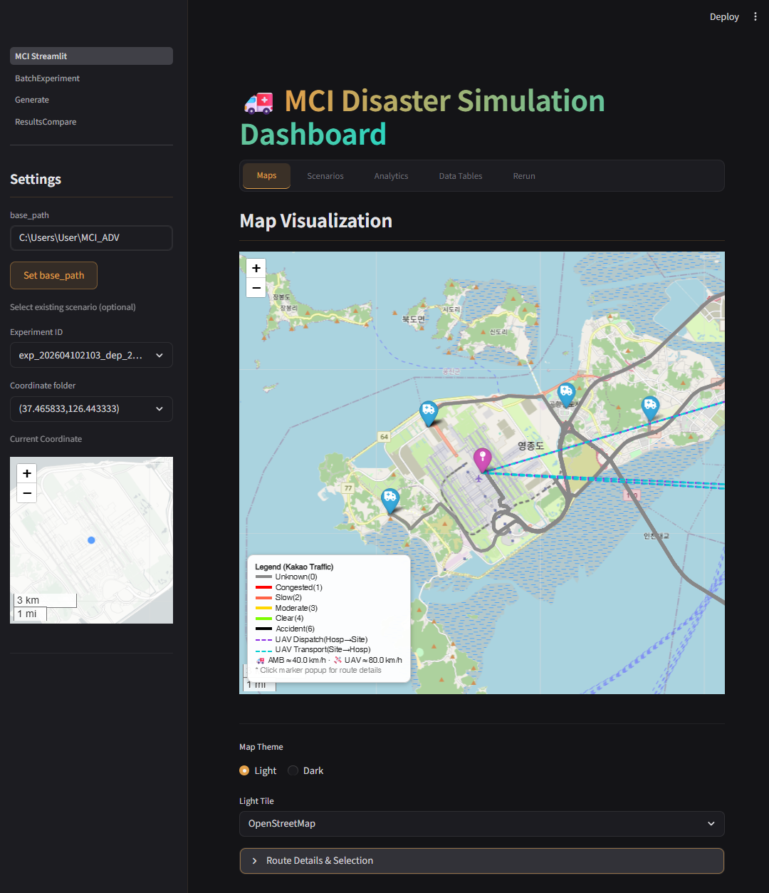
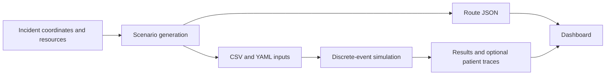

<div align="center">

# ADReSS

**Automated Disaster Response Scenario Generation and Simulation**

Generate location-specific mass casualty incident scenarios and compare emergency medical response strategies with ambulances and UAVs.


[](https://www.sciencedirect.com/journal/simulation-modelling-practice-and-theory)

**Manuscript SIMPAT-D-26-712 is under minor revision; it has not been accepted for publication.**

</div>

---

## At a glance

| | |
|---|---|
| **Question** | Which patients should be transported to which hospitals, by ambulance or UAV? |
| **Approach** | Automated scenario generation and discrete-event simulation of 64 response-policy combinations. |
| **Local context** | Hospital and ambulance-station locations, resource capacities, and road-network routing. |
| **Outputs** | Survival-based performance metrics, response completion times, statistical comparisons, and interactive map replay. |

## Quick start

Use Python 3.12 with the pinned dependencies in this repository.

```bash
git clone https://github.com/bbcc1017/ADReSS.git
cd ADReSS
conda create -n adress python=3.12
conda activate adress
python -m pip install -r requirements.txt
python -m streamlit run src/vis_src/MCI_Streamlit.py
```

In the sidebar, confirm the project path, then select an existing experiment and coordinate or open **Generate** to create a scenario. New scenario generation requires access to a routing service; an existing scenario can be simulated without generating routes again.

## Dashboard preview




The existing dashboard includes maps and animation, patient timelines, statistical analysis, data tables, and simulation reruns.

---

## Pipeline


```mermaid
flowchart LR
    A[Incident coordinates and resources] --> B[Scenario generation]
    B --> C[CSV and YAML inputs]
    B --> D[Route JSON]
    C --> E[Discrete-event simulation]
    E --> F[Results and optional patient traces]
    D --> G[Dashboard]
    F --> G
```

- **Generate:** select nearby ambulance stations and hospitals, obtain road routes, and build scenario files.
- **Simulate:** represent rescue, dispatch, transportation, hospital queues, and treatment using ambulances and UAVs.
- **Compare:** evaluate `2 priorities × 2 hospital-selection rules × 4 Red transport modes × 4 Yellow transport modes = 64 policies`.
- **Inspect:** compare survival-based outcomes and completion time using maps, timelines, ANOVA/post-hoc analysis, and Pareto views.

## Usage

<details open>
<summary><b>Generate a scenario without a Kakao API key</b></summary>

Run from the repository root:

```bash
python src/sce_src/make_csv_yaml_dynamic.py --base_path . --latitude 37.5665 --longitude 126.9780 --incident_size 30 --amb_count 30 --uav_count 3 --is_use_time false --experiment_id osrm_demo
```

This uses OSRM road distances and sets simulation travel times to distance divided by vehicle speed. It does not model traffic congestion. To use your own OSRM server, add `--osrm_url http://localhost:5000`.

The generator prints `CONFIG_PATH` when complete. Use a distinct experiment ID for each scenario-generation run you want to retain; reusing an ID and coordinate replaces generated files.

</details>

<details>
<summary><b>Use Kakao routing or run an existing scenario</b></summary>

For Kakao routing, use the **Generate** page to supply a REST API key and departure time, or pass `--is_use_time true --kakao_api_key YOUR_KEY` to the generator. The optional `--departure_time` uses `YYYYMMDDHHMM` format. Keep API keys out of committed files.

To simulate an existing configuration, replace the placeholder with the generated YAML path:

```bash
python src/sim_src/main.py --config_path "/absolute/path/to/config.yaml"
```

Add `--trace` to save per-patient event traces for the dashboard timeline. For the full generator options:

```bash
python src/sce_src/make_csv_yaml_dynamic.py --help
```

</details>

<details>
<summary><b>Data, outputs, and regional adaptation</b></summary>

The supplied master datasets are in `scenarios/`:

| File | Purpose |
|---|---|
| `fire_stations.csv` | Ambulance-station locations and available vehicles. |
| `hospital_master_data.xlsx` | Hospital locations, tiers, beds, operating rooms, and helipad indicators. |
| `DISTANCE_MATRIX_FINAL.xlsx` | Inter-hospital road distances for hospital diversion. |

For another region, prepare local data in the supplied formats, align hospital identifiers with the distance matrix, and adapt routing and simulation parameters to local conditions.

Generated scenarios are stored under `scenarios/<experiment>/<coordinate>/`; results are stored under `results/<experiment>/<coordinate>/`. Scenario CSV/YAML files describe the simulation inputs, while `routes/` stores route information for the dashboard. Results include raw values, statistical summaries, and optional `trace_*.json` files.

</details>

## Repository guide

| Location | Contents |
|---|---|
| [`src/sce_src/`](src/sce_src/) | Scenario generator and execution orchestrator. |
| [`src/sim_src/`](src/sim_src/) | Discrete-event engine, response rules, and configuration. |
| [`src/vis_src/`](src/vis_src/) | Existing Streamlit dashboard and pages. |
| [`scenarios/`](scenarios/) | Master data and generated scenarios. |
| [`experiment_1/`](experiment_1/) | Coordinate generation, resumable batch experiments, and result visualization. |
| [`USER_MANUAL_EN.md`](USER_MANUAL_EN.md) | Detailed user manual ([PDF](USER_MANUAL_EN.pdf)). |

---

## Manuscript

**Automated disaster response scenario generation and simulation for evaluating emergency medical services system**

Yeon-Woo Ryu, Jeong-Woo Kim, and Hyun-Rok Lee

Submitted to *Simulation Modelling Practice and Theory*; currently under minor revision (SIMPAT-D-26-712).

This is research software for simulation-based evaluation, not a clinically validated operational dispatch system. License terms will be specified upon publication.

<details>
<summary><b>Citation and funding</b></summary>

```bibtex
@unpublished{ryu2026automated,
  title  = {Automated disaster response scenario generation and simulation for evaluating emergency medical services system},
  author = {Ryu, Yeon-Woo and Kim, Jeong-Woo and Lee, Hyun-Rok},
  year   = {2026},
  note   = {Manuscript under minor revision at Simulation Modelling Practice and Theory, SIMPAT-D-26-712}
}
```

This work was supported by the Institute of Information & Communications Technology Planning & Evaluation (IITP) grant funded by the Korea government (MSIT) (No. RS-2025-02304718, Development of multi-hazard disaster response method using adversarial disaster generation agent).

</details>

## Contact

Department of Industrial Engineering, Inha University, Republic of Korea

| Author | Role | Email |
|---|---|---|
| Yeon-Woo Ryu | M.S. Student | [bbcc1017@inha.edu](mailto:bbcc1017@inha.edu) |
| Jeong-Woo Kim | B.S. Student | [kimjeongwoo12210599@inha.edu](mailto:kimjeongwoo12210599@inha.edu) |
| Hyun-Rok Lee | Professor, Corresponding Author | [hyunrok.lee@inha.ac.kr](mailto:hyunrok.lee@inha.ac.kr) |
